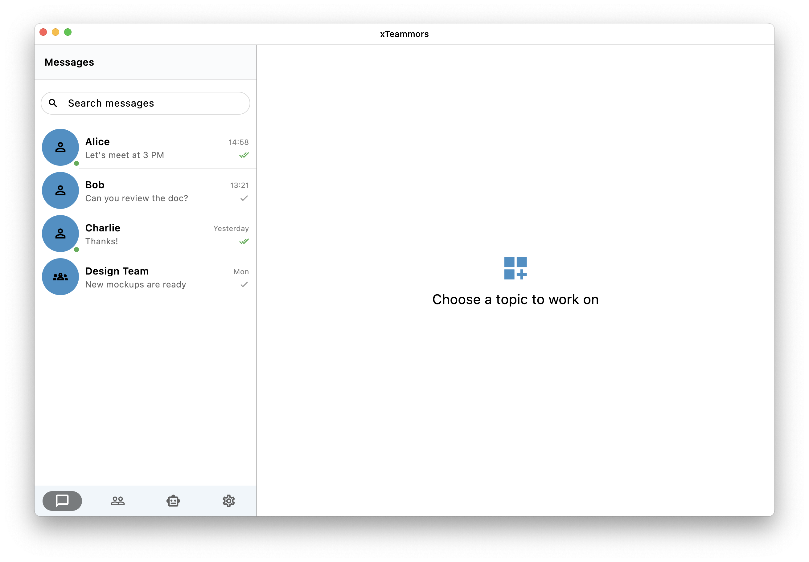
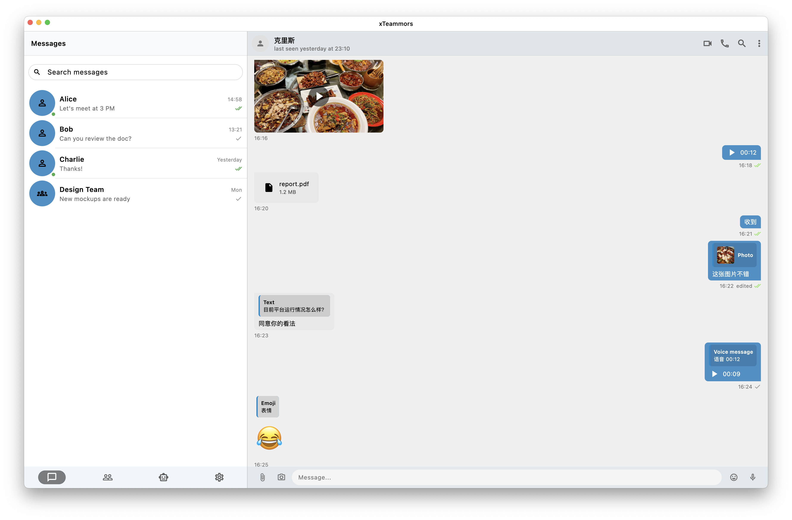
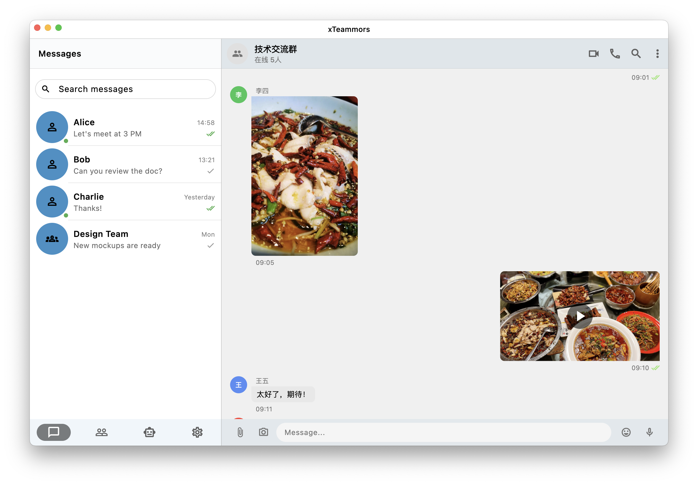
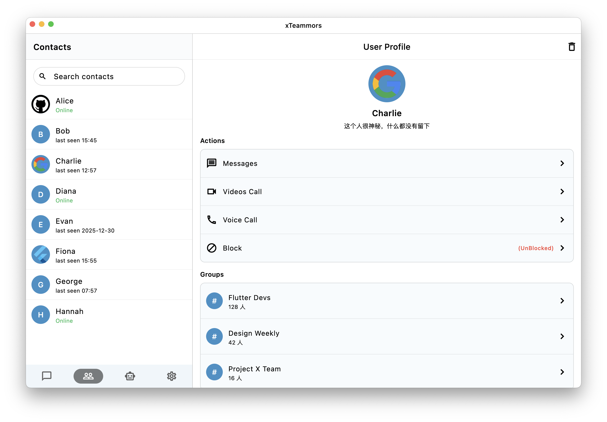
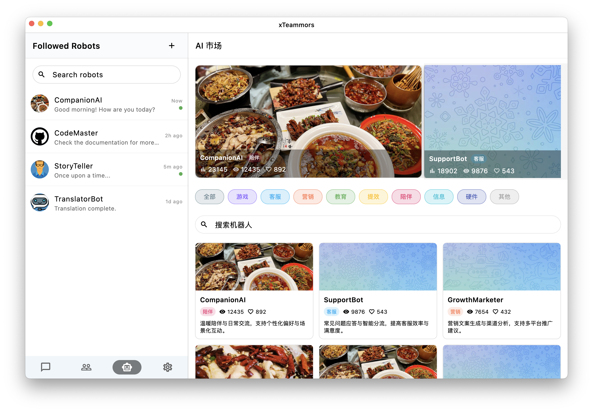
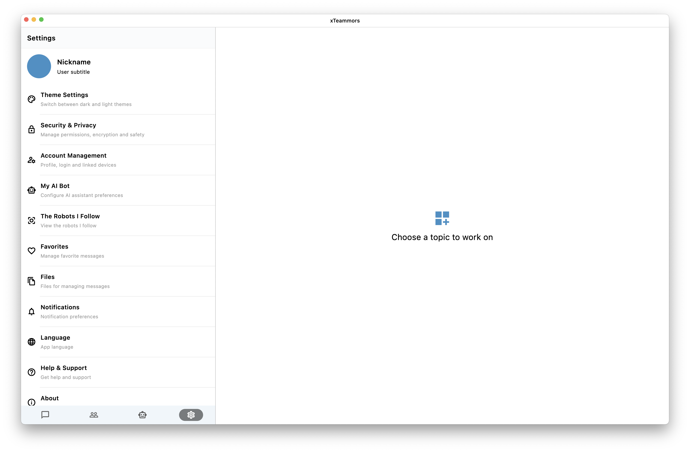

# XTeammors

**English** | [中文](./README_zh.md)

A smart Instant Messaging (IM) client built with Flutter, featuring real-time communication, AI robot integration, and secure messaging.

## 📂 Project Structure

The project follows a clean **MVVM (Model-View-ViewModel)** architecture for separation of concerns and maintainability.

```
lib/
├── beans/          # Data models and entities (e.g., ChatMessage, MessageBody)
├── data/           # Local database configuration (Drift/SQLite)
├── paras/          # Global parameters and constants
├── security/       # Security & Encryption logic (RSA, Keys)
├── utils/          # Utility classes (Camera, HTTP, JSON, Logs, Time, Toast)
├── viewmodels/     # ViewModels handling business logic (MVVM pattern)
│   ├── ai_market_viewmodel.dart
│   ├── chat_viewmodel.dart
│   ├── messages_viewmodel.dart
│   └── ...
├── views/          # UI Components and Pages
│   ├── ai_detail.dart
│   ├── chat_page.dart
│   ├── contacts_page.dart
│   ├── messages_page.dart
│   ├── settings_page.dart
│   └── ...
├── websocket/      # WebSocket implementation for Real-time IM SDK
└── main.dart       # Application entry point
```

## ✨ Features

### 1. Instant Messaging (IM)
- **Real-time Communication**: Powered by WebSocket for low-latency messaging.
- **Rich Media Support**: Send and receive Text, Images, Video, and Audio messages.
- **Group & Private Chat**: Seamless support for both 1-on-1 and group conversations.
- **Message History**: Local storage via SQLite (Drift) for offline access.

### 2. AI Integration 🤖
- **AI Market**: Browse and discover various AI robots for different purposes (Companion, Efficiency, etc.).
- **Smart Interaction**: Chat with AI robots just like human contacts.
- **Follow System**: Follow your favorite robots for quick access.
- **Management**: Dedicated views to manage followed robots and settings.

### 3. Contacts & Profiles
- **Contact Management**: View and search contacts.
- **Profiles**: Detailed user and group profiles with avatar, bio, and status.

### 4. Security 🔒
- **End-to-End Encryption**: Built-in RSA encryption utilities ensuring message privacy.
- **Secure Key Management**: Tools for generating and managing RSA key pairs.

### 5. Cross-Platform & UI
- **Desktop First**: Optimized for macOS, Windows, and Linux with custom window management (`bitsdojo_window`).
- **Responsive Design**: Adaptive UI that works on both Desktop and Web/Mobile.
- **Theming**: Support for Light, Dark, and System themes.

## 🛠 Development Environment

To build and run this project, ensure you have the following environment set up:

- **Flutter SDK**: `>=3.7.0`
- **Dart SDK**: `>=3.2.3 <4.0.0`

### Key Dependencies
- **State Management**: `provider`
- **Database**: `drift` (SQLite)
- **Networking**: `web_socket_channel`, `dio`, `http`
- **Security**: `pointycastle`, `encrypt`, `fast_rsa`
- **Desktop Integration**: `bitsdojo_window`, `window_manager`
- **Media**: `video_player`, `audioplayers`, `image_picker`

## 🚀 Getting Started

1.  **Clone the repository**:
    ```bash
    git clone <repository-url>
    cd xteammors
    ```

2.  **Install dependencies**:
    ```bash
    flutter pub get
    ```

3.  **Run the application**:
    - **macOS**:
      ```bash
      flutter run -d macos
      ```
    - **Windows**:
      ```bash
      flutter run -d windows
      ```
    - **Linux**:
      ```bash
      flutter run -d linux
      ```

## 🖼 Example Images

Below are example screenshots from the project:









## 📝 License

The project consents the MIT license.
